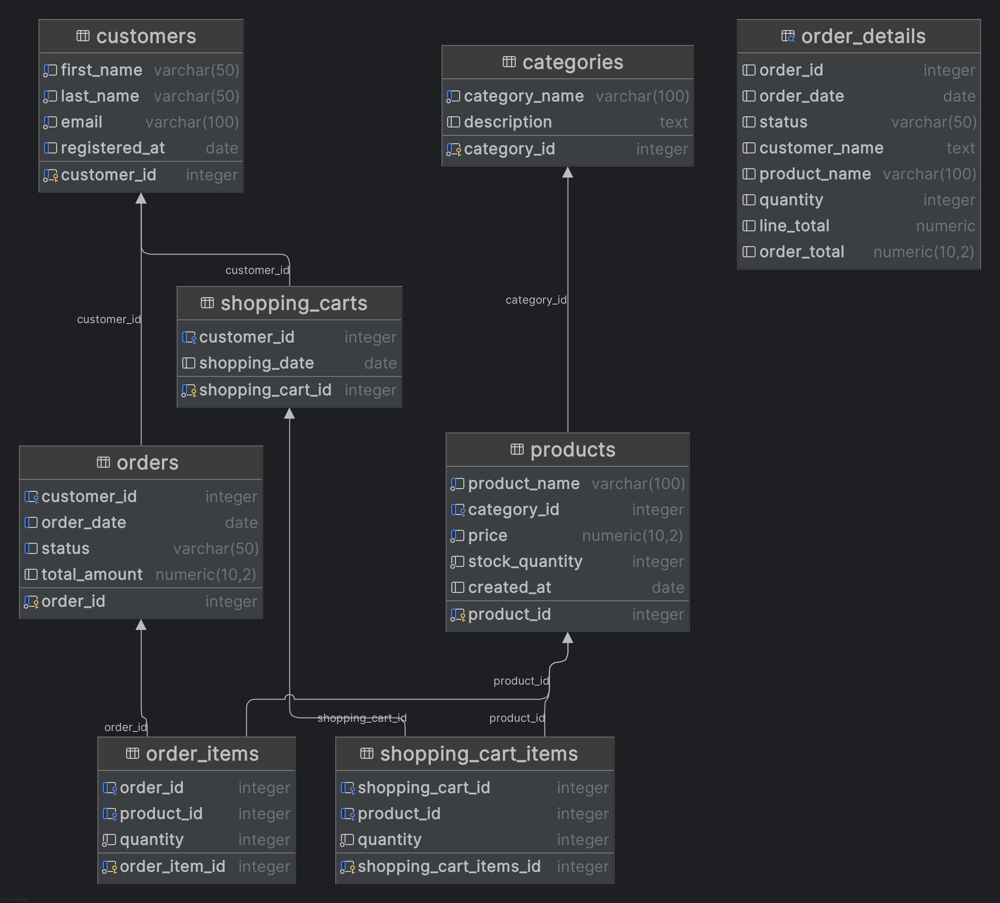

# Java Database Project

## Project Description

This project is a Java-based application that integrates with a PostgreSQL database. It emulates a
real-world e-commerce system, serving as a practical example of how such systems are developed and
maintained. The application supports CRUD (Create, Read, Update, Delete) operations on various
entities and includes advanced SQL queries for data retrieval and manipulation.

The primary focus of this project is on PostgreSQL itself and its interaction with Java. It
demonstrates best practices in database design, SQL query optimization, and effective integration
with Java applications using JDBC.

### Key Features:

- **Interactive Menu:** Provides a user-friendly, selectable menu to perform various tasks,
  including
  running SQL scripts, executing specific queries, and managing transactions.

- **Script Execution:** Allows users to execute SQL scripts directly by reading files, enabling
  batch
  operations with ease.

- **Query and Transaction Options:** Offers an optional feature to execute predefined SQL queries or
  perform complex database transactions interactively.

- **View Selection:** Enables users to select and display database views, providing insights into
  aggregated or filtered data.

- **CRUD Operations:** Seamlessly create, read, update, and delete data for key entities such as
  customers, categories, products, orders, and shopping carts.

- **Advanced SQL Queries:** Execute complex SQL queries for tasks like searching, filtering, and
  aggregating data to meet specific business needs.

- **Database Relationships:** Manage and maintain relationships between tables, such as orders and
  their
  corresponding order_items, ensuring data integrity.

- **PostgreSQL Focus:** Demonstrates effective PostgreSQL usage, including schema design, query
  optimization, and database transactions.

- **Indexes:** Improve the performance of SQL queries by implementing indexes for faster retrieval
  of records.

- **Java-PostgreSQL Integration:** Highlights best practices for connecting Java applications to
  PostgreSQL using JDBC for efficient data operations.

---

## Database Schema

The database schema includes the following tables:

- `customers`
- `categories`
- `products`
- `orders`
- `order_items`
- `shopping_carts`
- `shopping_cart_items`

### ER Diagram



## Setup and Run Instructions

### Prerequisites

- **Java JDK 22 or higher**.
- **Maven 3.6 or higher**.
- **PostgreSQL 13 or higher**.

### Installation

1. Install **PostgreSQL**:

- Download PostgreSQL from [the official website](https://www.postgresql.org/download/).
- Follow the installation instructions specific to your operating system.

2. **Create a New User and Database**:
   Connect to PostgreSQL as a superuser (e.g., `postgres`) and execute the following SQL commands to
   create the user, database, and grant necessary privileges:

   ```sql
   CREATE USER new_user WITH PASSWORD 'password';
   CREATE DATABASE omop2_db;
   GRANT ALL PRIVILEGES ON DATABASE omop2_db TO new_user;

3. **Run the SQL Scripts**:
   After setting up the user and database, execute the SQL scripts to set up the schema and
   permissions:
   ```bash
   psql -U new_user -d omop2_db -f src/main/resources/sql/user_create.sql
   psql -U new_user -d omop2_db -f src/main/resources/sql/omop2_db.sql
   ```
4. Clone the repository:
   ```bash
   git clone https://github.com/Team-OMO-Org/p2-psql-module.git
   cd p2-psql-module
   ```
5. Build the project:
   ```bash
   mvn clean install
   ```
6. Run the application:
   ```bash
   mvn spring-boot:run
   ```

### Configuration

Edit `application.properties`:

```properties
db.url=jdbc:postgresql://localhost:5432/omop2_db
db.username=new_user
db.password=password
db.driver=org.postgresql.Driver
```

---

## Examples of SQL queries

1. This query calculates the total sales for each product category, including the category name and
   total sales amount.

```sql
SELECT c.category_name,
       SUM(oi.quantity * p.price) AS total_sales
FROM order_items oi
         JOIN
     products p ON oi.product_id = p.product_id
         JOIN
     categories c ON p.category_id = c.category_id
GROUP BY c.category_name
ORDER BY total_sales DESC;
```

2. This query retrieves the top 5 customers based on the total amount spent on orders.

```sql
SELECT c.customer_id,
       c.first_name,
       c.last_name,
       SUM(o.total_amount) AS total_spent
FROM customers c
         JOIN
     orders o ON c.customer_id = o.customer_id
GROUP BY c.customer_id, c.first_name, c.last_name
ORDER BY total_spent DESC
LIMIT 5;
```

3. This query retrieves detailed information about orders, including customer details, product
   details, and the total amount for each order.

```sql
SELECT o.order_id,
       o.order_date,
       o.status,
       c.first_name || ' ' || c.last_name AS customer_name,
       p.product_name,
       oi.quantity,
       (oi.quantity * p.price)            AS line_total,
       o.total_amount                     AS order_total
FROM orders o
         JOIN
     customers c ON o.customer_id = c.customer_id
         JOIN
     order_items oi ON o.order_id = oi.order_id
         JOIN
     products p ON oi.product_id = p.product_id
ORDER BY o.order_date DESC;
```

---

